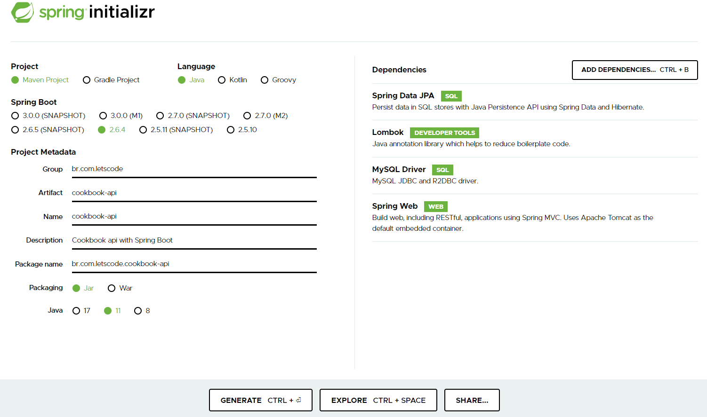

# Projeto Cookbook usando Spring Boot Maven

&nbsp;
&nbsp;
&nbsp;

Este projeto foi desenvolvido utilizando o padrão de projeto MVC, utilizando o framework Spring Boot, e utilizando o framework Maven, agregando a integração com o banco MySQL

Para carregar a primeira versão do projeto, basta acessar o link https://start.spring.io/
 e na sequência marcar as opções conforme figura abaixo, adicionando as dependências: 
 

* Spring Data JPA
* Spring Web
* Lombok
* MySQL driver

Ao final, clicar em <b>generate</b> para que seja gerado o pacote no formato zip.

Descompactar o arquivo .zip gerado, e mover para o diretório onde deseja criar seu projeto.

 Após abrir o projeto no InteliJ, aguardar a instalação/download dos pacotes spring boot, clicar em resources e abrir o <b>application.properties</b> 

para adicionar as linhas que segue: 

* spring.datasource.url=jdbc:mysql://localhost:3306/cookbook
* spring.datasource.username=${cookbook.bd.user:root}
* spring.datasource.password=${cookbook.bd.pwd:root}

Alterar o arquivo de configuração das variáveis de ambiente para incluir o usuário e senha de acesso ao banco.

Executar o CookbookApiApplication e confirmar que o spring boot esta ativo 

