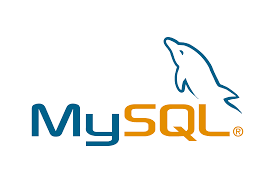

# Java Projects

This repository was created to share all projects developed in cooperation with all Devs from Let's Code / Iguatemi 50+ project and their instructors.

Este repositório foi criado para compartilhar todos os projetos desenvolvidos durante o treinamento da linguagem  Java em conjunto com os Devs da turma Let's Code / Iguatemi 50+ e seus instrutores

